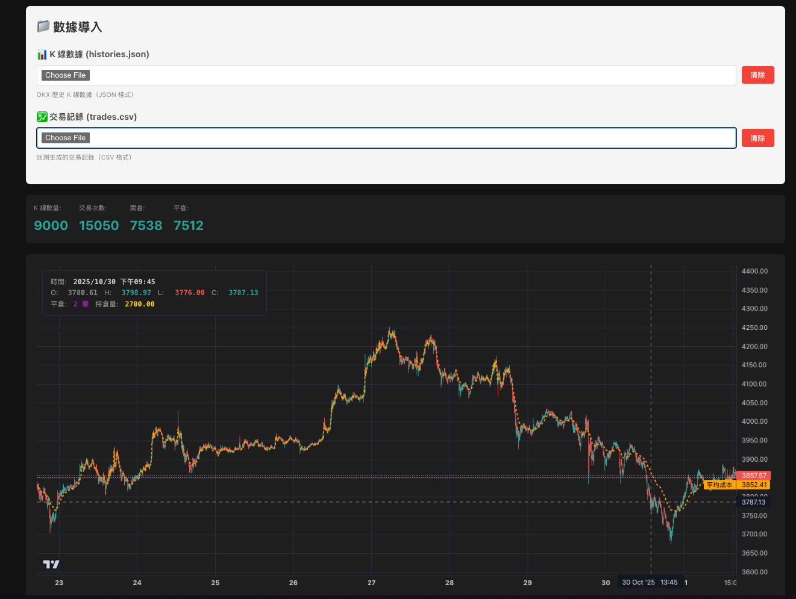

# Trading System

量化交易系統，採用分散式系統架構(微服務)

## 系統架構

Dockerized Monorepo 微服務架構，Golang + TypeScript。

### 專案架構

- **Monorepo**：使用 Go Workspace (`go.work`) 管理多服務
- **共享模組**：`go-packages/` 存放通用程式碼（logger、shared domain 等）
- **獨立部署**：各服務可獨立編譯、測試、部署

```
=== 即時交易系統 ===

┌─────────────┐   SET/LPUSH  ┌─────────────────────────────────┐
│ market-data │─────────────▶│             Redis               │
│   server    │              │  (Price Oracle / KV Store)      │
│    (Go)     │              └─────────────────────────────────┘
└──────┬──────┘                        ▲
       │                               │ GET/LRANGE
       ▼                  (optional)   │
   ┌───────┐                 ┌─────────┴─────────┐
   │  OKX  │                 │                   │
   │  WS   │                 │                   │
   └───────┘                 ▼                   ▼
                    ┌───────────────┐    ┌─────────────┐
                    │   trading-    │◀───│   order-    │
                    │   strategy-   │gRPC│   server    │
                    │    server     │    │    (Go)     │
                    │  (Go / DDD)   │    └──────┬──────┘
                    │  [Stateless]  │           │
                    └───────────────┘           ▼
                                           ┌────────┐
    Order 輪詢 Strategy 詢問開倉建議          │  OKX   │
    Strategy 無狀態，只負責計算               │  API   │
                                           └────────┘

=== 回測 & 視覺化 (獨立) ===

┌───────────────┐  export   ┌─────────────────┐
│   trading-    │──────────▶│ chart-dashboard │
│   strategy-   │  (JSON)   │  (TypeScript)   │
│     server    │           │                 │
│               │           │  (Vite-React)   │
│               │           │                 │
│               │           └─────────────────┘
│   /backtest   │
└───────────────┘
```

## 服務列表 (`apps/`)

| 服務                        | 語言       | 架構         | 狀態       | 說明                                     |
| --------------------------- | ---------- | ------------ | ---------- | ---------------------------------------- |
| **market-data-server**      | Go         | Layered      | 🟢 Core    | OKX WebSocket 即時行情接收，存儲至 Redis |
| **trading-strategy-server** | Go         | **DDD**      | 🟢/🟡      | 回測系統 🟢 Core / 策略引擎 🟡 Scaffold  |
| **order-server**            | Go         | Layered      | ⚪ Planned | 訂單執行服務（僅 gRPC proto 定義）       |
| **chart-dashboard**         | TypeScript | Vite + React | 🟢 Core    | K 線圖表前端                             |

> **狀態說明**
>
> 🟢 Core = 核心功能完成，持續優化中
>
> 🟡 Scaffold = 骨架建立，功能開發中
>
> ⚪ Planned = 規劃中

> **開發重心**
>
> 目前專注於**回測系統**的策略驗證，待回測結果滿意後，再將邏輯遷移至即時策略引擎。
>
> `backtest/` → 驗證完成 → `strategy/`

---

## 資料流說明

### 1. market-data-server (Price Oracle)

**職責**：即時行情接收與存儲

```
OKX WebSocket API
    │
    │ Subscribe: tickers, candles
    ▼
┌─────────────────────┐
│  market-data-server │
│                     │
│  • 接收即時價格       │
│  • 接收 K 線數據      │
│  • 格式化後存儲       │
└──────────┬──────────┘
           │
           │ SET / LPUSH
           ▼
┌─────────────────────┐
│   Redis (KV Store)  │
│                     │
│  • price.latest.*   │  ← String (SET)
│  • candle.latest.*  │  ← String (SET)
│  • candle.history.* │  ← List (LPUSH)
└─────────────────────┘
           │
           │ GET / LRANGE (optional)
           ▼
    其他服務可讀取
```

**Redis 存儲**：
| Key Pattern | 類型 | 說明 |
|-------------|------|-----|
| `price.latest.{instId}` | String | 即時價格 (TTL 60s) |
| `candle.latest.{bar}.{instId}` | String | 最新 K 線 (動態 TTL) |
| `candle.history.{bar}.{instId}` | List | 歷史 K 線 (LPUSH, 保留 N 根) |

**啟動**：

```bash
cd apps/market-data-server && go run ./cmd/main.go
```

> 詳細配置與架構請參考 [apps/market-data-server/README.md](./apps/market-data-server/README.md)

---

### 2. 歷史資料下載器 (scripts)

**職責**：下載 OKX 歷史 K 線數據，供回測使用

```
OKX REST API
    │
    │ GET /api/v5/market/history-candles
    ▼
┌─────────────────────────┐
│  download_okx_history   │
│                         │
│  • 分頁下載歷史 K 線       │
│  • Rate Limit 處理       │
│  • 自動重試機制           │
└───────────┬─────────────┘
            │
            │ Export
            ▼
┌─────────────────────────┐
│     data/{日期範圍}/     │
│     {instId}/{bar}/     │
│       history.json      │
└─────────────────────────┘
```

**啟動**：

```bash
pnpm install
pnpm download:okx \
  --inst-id=ETH-USDT-SWAP \
  --bar=5m \
  --after=2022-01-01T00:00:00Z \
  --before=2022-12-31T00:00:00Z
```

**輸出格式**：

```
data/20220101-20221231/ETH-USDT-SWAP/5m/history.json
```

---

### 3. trading-strategy-server (策略引擎 + 回測系統)

**職責**：策略計算與信號生成（DDD 架構）

#### 策略引擎 (即時模式)

> 需先啟動 `market-data-server` 才能從 Redis 讀取價格

```bash
cd apps/trading-strategy-server
cp .env.example .env
go run ./cmd/strategy/main.go
```

#### 回測系統

```bash
cd apps/trading-strategy-server
go run ./cmd/backtest/main.go --data=../../data/xxx/history.json
```

查看完整參數：`go run ./cmd/backtest/main.go --help`

> 詳細說明請參考 [apps/trading-strategy-server/README.md](./apps/trading-strategy-server/README.md)

---

### 4. chart-dashboard (K 線圖表視覺化)

**職責**：回測結果視覺化，顯示 K 線圖、交易標記、平均成本線

```
回測結果 (CSV/JSON)
    │
    │ 拖曳上傳
    ▼
┌─────────────────────────┐
│    chart-dashboard      │
│                         │
│  • K 線圖表              │
│  • 開倉/平倉標記          │
│  • 平均成本線             │
│  • 資金曲線              │
└─────────────────────────┘
```

**啟動**：

```bash
cd apps/chart-dashboard
pnpm install  # 首次需要安裝依賴
pnpm dev      # 啟動開發服務器 (http://localhost:5173)
```

**使用方式**：

1. 準備數據文件：`history.json`（K 線）+ `trades.csv`（交易記錄）
2. 啟動 chart-dashboard
3. 在「數據導入」區塊分別載入兩個文件
4. 查看 K 線圖、交易標記與平均成本線

**預覽**：



> 詳細說明請參考 [apps/chart-dashboard/README.md](./apps/chart-dashboard/README.md)
